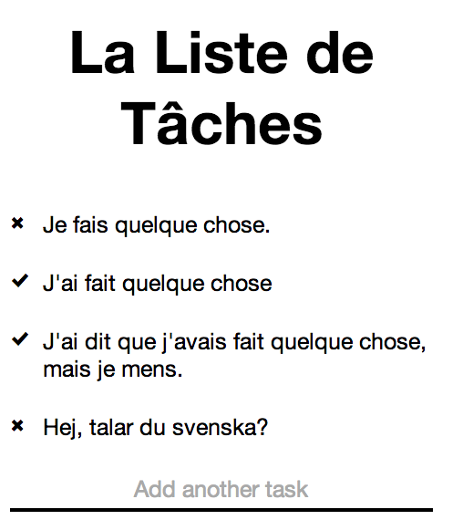

Basic TodoList.js
=================

Alexandre Astruc — 2014, no basic rights reserved.
--------------------------------------------------

Just a very basic Task List coded in basic JavaScript that works solely on the basic client side.

Basic things that can be done:

- Change the list's title,
- Add a basic task,
- Mark it as done by clicking on it,
- Change its title by basically double-clicking (long-tapping on touch-screen) on the label,
- Delete it by double-clicking (long-tapping on touch-screen) on the mark once it's set as done,
- Get basic help by typing 'help',
- Get a list of commands by typing 'commands',
- Save basically each two minutes,
- Force saving by typing 'save'.
- Use it on your basic sophisticated phone.

Basic screenshot in basic French:

